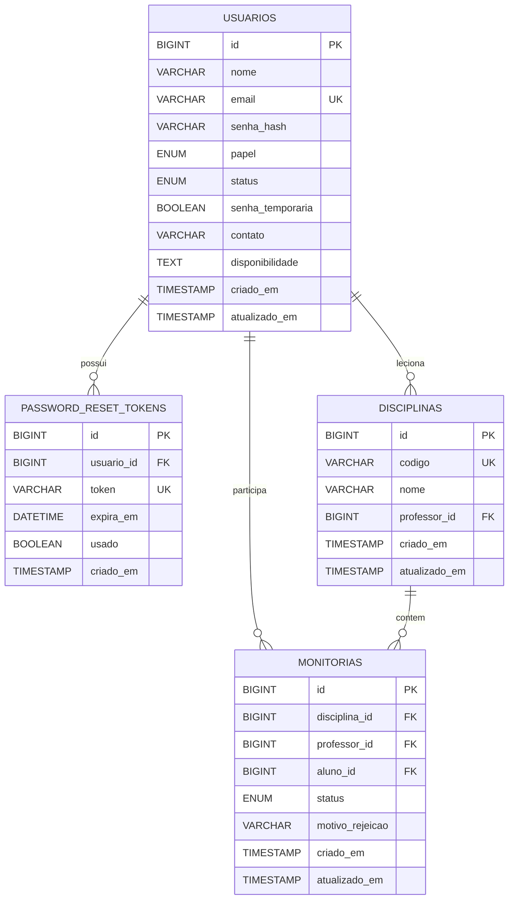

# Modelagem do Banco de Dados

Modelo inicial para suportar EP00 e EP01 (infra + perfis/autenticacao), mantendo compatibilidade com EP02 em diante.

## Diagrama ER (Mermaid)

## Arquivo SQL

O schema completo esta em [backend/db/schema.sql](../backend/db/schema.sql).
